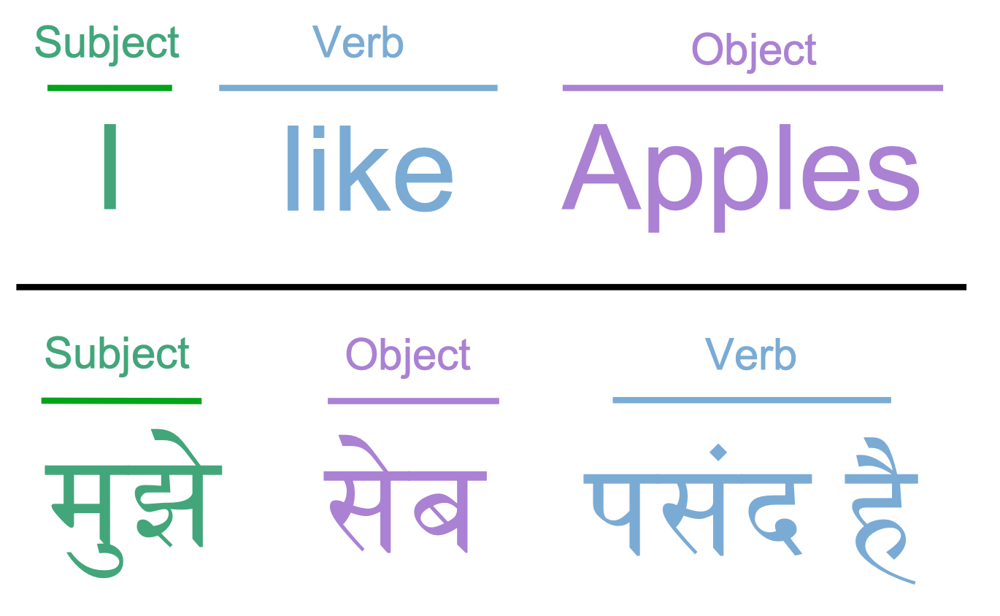

#### Background

Douglas Adams created the Babel fish in 1978 for "Hitchhiker's Guide to the Galaxy." This small yellow fish would attach itself to the inside of your ear, translating any language.

In this coding exercise, you'll create a simple translation app.

#### Language Format  
  
English is written as Subject-Verb-Object (SVO.)  
Hindi is written Subject-Object-Verb (SOV.)  



#### Scenarios

1: While using a Babel fish, the user can understand a different language

```feature
  Scenario: While using a Babel fish, the user can understand a different language
    Given Skylar only understands English
    When Dhaval says, "मुझे सेब पसंद है"
    Then Skylar hears, "I like apples"
```

When writing unit-tests, ensure you're doing the simplest thing possible. It's also important to ensure the object, subject, and verb are mapped correctly. Here are additional sentences to validate the mapping is done correctly.  
  
You like apples - तुम्हें सेब पसंद है  
You dislike apples - तुम्हें सेब नापसंद है  
  
2: The Babel fish can translate compound sentences

```feature
Scenario: The Babel fish can translate compound sentences
  Given Skylar only understands English
  When Dhaval says, "मुझे सेब पसंद है और तुम्हें मिठाई नापसंद है"
  Then Skylar hears, "I like apples and you dislike sweets"
```

3: The Babel fish can translate in both directions  

```feature
Scenario: The Babel fish can translate in both directions  
  Given Dhaval only understands Hindi
  When Skylar says, "I like apples"
  Then Dhaval hears, "मुझे सेब पसंद है"
```
